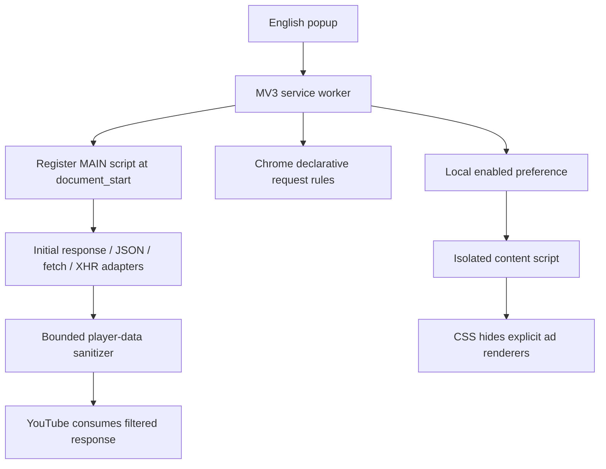

# TubeQuiet

An English-only, YouTube-focused Chrome Manifest V3 extension. Version 0.1.0 is a development release. Filtering is best effort; YouTube experiments and server-side ads may defeat it. See [validation](docs/VALIDATION.md) before publishing.

## Install for development

1. Open `chrome://extensions` in a Chrome profile without another ad blocker.
2. Enable Developer mode, choose **Load unpacked**, select this repository's `extension` directory.
3. Open TubeQuiet from the extensions menu and reload YouTube tabs.
4. Use **Ad protection** to pause/resume. Reload all already-open YouTube tabs after changing it.

Chrome 120+; desktop `www.youtube.com`, `youtube.com`, and `m.youtube.com`. No support promise for YouTube Music, Studio, third-party embedded players, paid content access, or creator sponsorship segments.

## Development

Node 22+ and Python 3; no npm installation or runtime dependencies required.

```sh
npm test
npm run check
npm run package
```

`extension/` is the readable, directly runnable source. The store ZIP places `manifest.json` at its root. `dist/` also contains corresponding source and SHA256SUMS. GitHub CI runs the same checks. Edit files, reload the extension in Chrome, then reload YouTube.

## Architecture



Only recognized player advertising fields and explicitly marked Shorts ads are pruned. Streaming URLs, playback errors, subtitles and ordinary video data are retained. Three local network rules target ad requests with YouTube initiators. The popup checks registration and ruleset state, rather than inventing an ad-block count. CSS toggles immediately; page-world hooks need a reload to fully pause.

There is no server, analytics, remote executable code, account system or remotely downloaded rule interpreter. Only one boolean preference is stored locally. YouTube response data is inspected in memory and is not transmitted by TubeQuiet.

## Release materials

- [Submission checklist (Chinese)](docs/PUBLISH.zh-CN.md)
- [English listing and permission explanations](store/LISTING.md)
- `extension/privacy.html`: in-product privacy and source explanation
- `store/PRIVACY.md`: public privacy-page draft; fill publisher contact before hosting
- `store/assets/`: original icon and small promotional tile
- [Validation and release gate](docs/VALIDATION.md)

## License and reference

GPL-3.0-or-later. uBlock Origin / uBlock Origin Lite informed the filtering approach and field/selector research; their runtime is not bundled. See [THIRD_PARTY_NOTICES.md](THIRD_PARTY_NOTICES.md) for exact revisions. The distributed extension includes its readable source and GPL license. Keep these in releases, preserve notices and give recipients corresponding source and GPL rights. A private development repository does not remove distribution obligations. TubeQuiet is independent of Google, YouTube and uBlock Origin.
