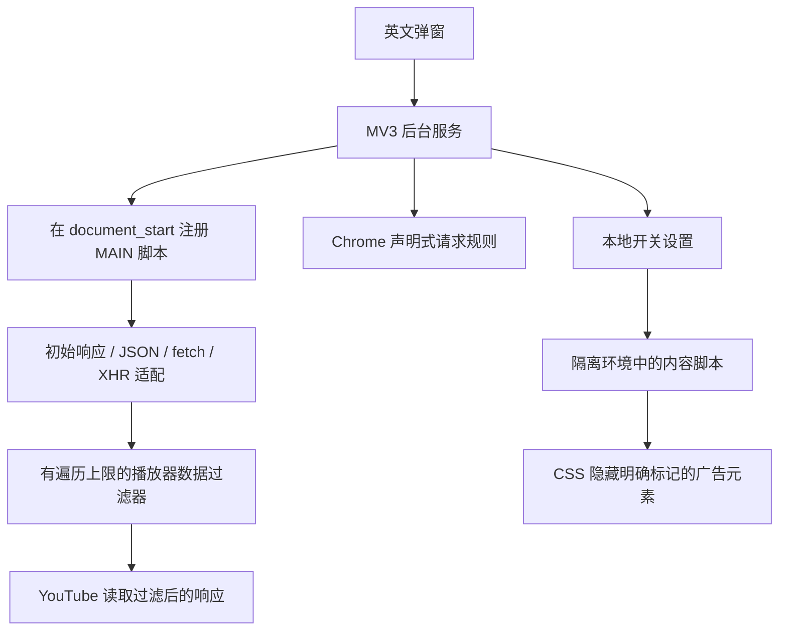

# TubeQuiet

[English](README.md) | **简体中文**

专注于 YouTube 的 Chrome Manifest V3 扩展，插件界面为英文。0.1.1 是开发版本，广告过滤效果可能受 YouTube 实验功能和服务端广告影响。发布前请查看[验证记录](docs/VALIDATION.md)（英文）。

## 安装

**[中文安装指南（从 GitHub 下载到安装）](docs/INSTALL.zh-CN.md)** — 从 GitHub 自行下载并安装到 Chrome，无需编程。

## 开发环境安装

1. 在没有启用其他广告拦截器的 Chrome 个人资料中打开 `chrome://extensions`。
2. 开启开发者模式，点击 **加载已解压的扩展程序（Load unpacked）**，选择本仓库的 `extension` 目录。
3. 从扩展菜单打开 TubeQuiet，然后刷新 YouTube 标签页。
4. 使用开关开启或关闭过滤。切换后，已打开的 YouTube 标签页会自动刷新。
5. 隐私和源码说明可通过 Chrome 中的扩展 **选项（Options）** 查看。

要求 Chrome 120 或更新版本，支持电脑端访问 `www.youtube.com`、`youtube.com` 和 `m.youtube.com`。不承诺支持 YouTube Music、Studio、第三方网站内嵌播放器、付费内容解锁或视频作者的赞助片段。

## 开发

需要 Node 22 或更新版本及 Python 3；无需执行 npm install，也没有运行时依赖。

```sh
npm test
npm run check
npm run package
```

`extension/` 内是可读、可直接运行的源码。商店安装包 ZIP 的根目录包含 `manifest.json`；`dist/` 同时包含对应源码包和 SHA256SUMS 校验文件。GitHub CI 执行相同检查。修改文件后，在 Chrome 中重新加载扩展，再刷新 YouTube。

## 架构



只删除已识别的播放器广告字段和明确标记的 Shorts 广告。视频流地址、播放错误、字幕和普通视频数据会保留。三条本地网络规则处理由 YouTube 发起的广告请求。弹窗检查实际的脚本注册和规则集状态，不提供虚构的拦截计数。CSS 遵循本地设置；切换后，后台服务刷新支持的 YouTube 标签页，使页面脚本也应用新设置。刷新失败时会在弹窗中提示。

没有服务器、统计分析、远程执行代码、账号系统或远程下载的规则解释器。本地只存储一个布尔开关设置。YouTube 响应数据仅在内存中检查，TubeQuiet 不会将其传出。

## 发布材料

- [上架清单](docs/PUBLISH.zh-CN.md)
- [商店介绍和权限说明](store/LISTING.md)（英文）
- `extension/privacy.html`：插件内的隐私与源码说明（英文）
- `store/PRIVACY.md`：公开隐私政策草稿（英文），托管前填写发布者联系信息
- `store/assets/`：小宣传图；`scripts/make-assets.py` 用于生成插件图标
- [验证记录与发布条件](docs/VALIDATION.md)（英文）

## 许可证与参考来源

使用 GPL-3.0-or-later。过滤方法以及字段、选择器研究参考了 uBlock Origin / uBlock Origin Lite，未打包其运行时。具体版本见 [THIRD_PARTY_NOTICES.md](THIRD_PARTY_NOTICES.md)（英文）。分发的扩展包含可读源码及 GPL 许可证；发布时须保留许可证和归属说明，并向接收者提供对应源码及 GPL 授予的权利。开发仓库是否私有不改变分发义务。TubeQuiet 独立于 Google、YouTube 和 uBlock Origin。
